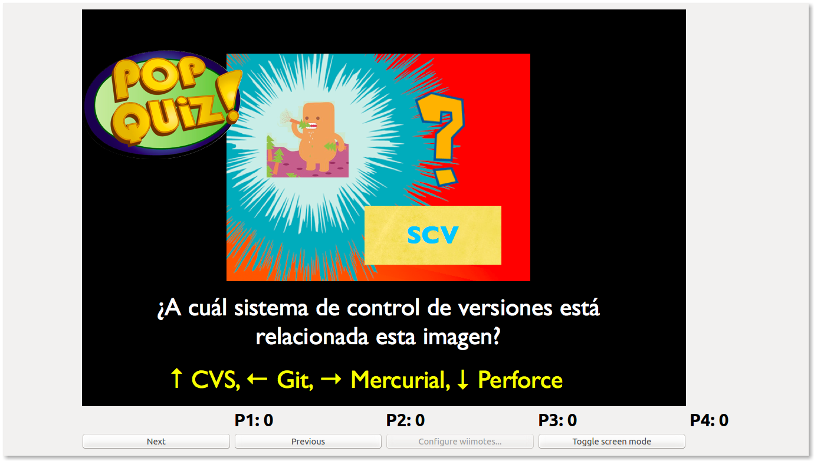

#SlideQuiz

* A (very basic) presentation tool with pop quiz support. Up to 4 players can compete using Wii remotes.
* It was made for a presentation in which we needed to quiz the audience. Four teams were given a Wii remote to test their comprehension and attention.
* It draws inspiration from the pop quizzes in Pokemon Stadium 2.



## Features 

* Slide navigation (prev/next). Once a quiz slide is played it can't be replayed.
* Scores
* Penalties

##Creating presentations

### Directory structure

Each presentation must have all its associated files in the same folder.

````
demo
| slides.json
| demo.001.png
| ...
| demo.018.png
````

### File format

Presentations are specified in a JSON file:

````json
{"slides":[
    {"type":"info", "src":"demo.001.png"},
    {"type":"quiz", "src":"demo.002.png", "score":1, "answer":"left"},
    {"type":"info", "src":"demo.003.png"},
    {"type":"info", "src":"demo.004.png"},
    {"type":"info", "src":"demo.005.png"},
    {"type":"quiz", "src":"demo.006.png", "score":2, "answer":"down"},
    {"type":"info", "src":"demo.007.png"},
    {"type":"info", "src":"demo.008.png"},
    {"type":"info", "src":"demo.009.png"},
    {"type":"quiz", "src":"demo.010.png", "score":2, "answer":"left"},
    {"type":"info", "src":"demo.011.png"},
    {"type":"info", "src":"demo.012.png"},
    {"type":"info", "src":"demo.013.png"},
    {"type":"quiz", "src":"demo.014.png", "score":2, "answer":"right"},
    {"type":"info", "src":"demo.015.png"},
    {"type":"info", "src":"demo.016.png"},
    {"type":"info", "src":"demo.017.png"},
    {"type":"quiz", "src":"demo.018.png", "score":2, "answer":"down"}]
} 
````

##Requirements

* PyQt 4
* cwiid

##Issues

* Wiimote configuration requires knowing their MAC addresses. You can use your OS's bluetooth device search feature to find them.
* Exiting from full-screen mode does not work.

##Future improvements
* Add a timer to quiz slides

##Authors

* Adolfo Garcia (@adolfocr)
* Luis Diego Garcia (@ldgarcia)

##License

The MIT License (MIT)

Permission is hereby granted, free of charge, to any person obtaining a copy
of this software and associated documentation files (the "Software"), to deal
in the Software without restriction, including without limitation the rights
to use, copy, modify, merge, publish, distribute, sublicense, and/or sell
copies of the Software, and to permit persons to whom the Software is
furnished to do so, subject to the following conditions:

The above copyright notice and this permission notice shall be included in
all copies or substantial portions of the Software.

THE SOFTWARE IS PROVIDED "AS IS", WITHOUT WARRANTY OF ANY KIND, EXPRESS OR
IMPLIED, INCLUDING BUT NOT LIMITED TO THE WARRANTIES OF MERCHANTABILITY,
FITNESS FOR A PARTICULAR PURPOSE AND NONINFRINGEMENT. IN NO EVENT SHALL THE
AUTHORS OR COPYRIGHT HOLDERS BE LIABLE FOR ANY CLAIM, DAMAGES OR OTHER
LIABILITY, WHETHER IN AN ACTION OF CONTRACT, TORT OR OTHERWISE, ARISING FROM,
OUT OF OR IN CONNECTION WITH THE SOFTWARE OR THE USE OR OTHER DEALINGS IN
THE SOFTWARE.
